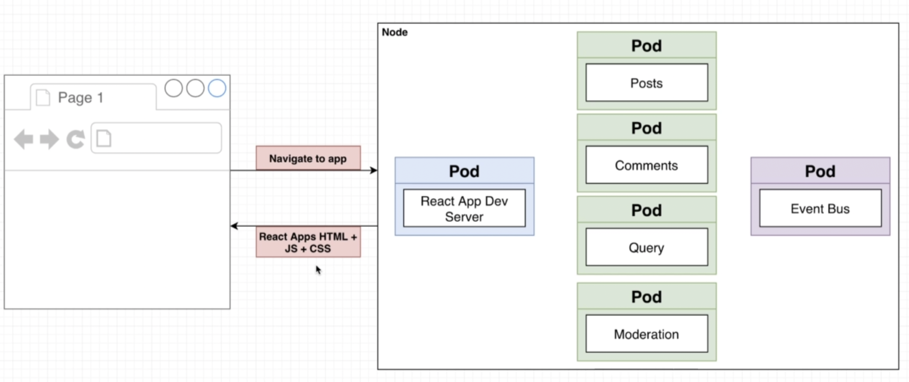

# mini-microservice-docker-destop
Build, deploy, and scale an E-Commerce app using Microservices built with Node, React, Docker and Kubernetes

## Diagram

## Deployed
- Use Docker Destop on Mac and installed Skaffold for K8s deployment
